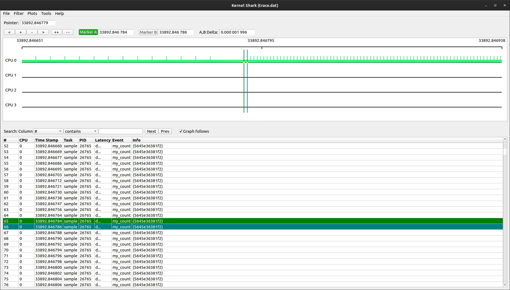

```shell
# Build
g++ -osample sample.cpp -g

# Find file offset for the desired trace point
objdump -F -D -S sample | less

# 00000000000011c9 <main> (File Offset: 0x11c9):
# /* #include <chrono> */

# /* using namespace std::chrono_literals; */

# int main(void)
# {
#     11c9:       f3 0f 1e fa             endbr64
#     11cd:       55                      push   %rbp
#     11ce:       48 89 e5                mov    %rsp,%rbp
#     11d1:       48 83 ec 10             sub    $0x10,%rsp
#   /* std::this_thread::sleep_for(1s); */
#   int foo{0};
#     11d5:       c7 45 f8 00 00 00 00    movl   $0x0,-0x8(%rbp)
#   for(int i{0}; i < 1000; ++i)
#     11dc:       c7 45 fc 00 00 00 00    movl   $0x0,-0x4(%rbp)
#     11e3:       81 7d fc e7 03 00 00    cmpl   $0x3e7,-0x4(%rbp)
#     11ea:       7f 0c                   jg     11f8 <main+0x2f> (File Offset: 0x11f8)
#   {
#     foo += i;
#     11ec:       8b 45 fc                mov    -0x4(%rbp),%eax
#     11ef:       01 45 f8                add    %eax,-0x8(%rbp)
#   for(int i{0}; i < 1000; ++i)
#     11f2:       83 45 fc 01             addl   $0x1,-0x4(%rbp)
#     11f6:       eb eb                   jmp    11e3 <main+0x1a> (File Offset: 0x11e3)
#   }
#   std::cout << "Result: " << foo << '\n';
#     11f8:       48 8d 35 06 0e 00 00    lea    0xe06(%rip),%rsi        # 2005 <_ZStL19piecewise_construct+0x1> (File Offset: 0x2005)
#     11ff:       48 8d 3d 3a 2e 00 00    lea    0x2e3a(%rip),%rdi        # 4040 <_ZSt4cout@@GLIBCXX_3.4> (File Offset: 0x4040)
#     1206:       e8 95 fe ff ff          callq  10a0 <_ZStlsISt11char_traitsIcEERSt13basic_ostreamIcT_ES5_PKc@plt> (File Offset: 0x10a0)
#     120b:       48 89 c2                mov    %rax,%rdx
#     120e:       8b 45 f8                mov    -0x8(%rbp),%eax
#     1211:       89 c6                   mov    %eax,%esi
#     1213:       48 89 d7                mov    %rdx,%rdi
#     1216:       e8 b5 fe ff ff          callq  10d0 <_ZNSolsEi@plt> (File Offset: 0x10d0)
#     121b:       be 0a 00 00 00          mov    $0xa,%esi
#     1220:       48 89 c7                mov    %rax,%rdi
#     1223:       e8 88 fe ff ff          callq  10b0 <_ZStlsISt11char_traitsIcEERSt13basic_ostreamIcT_ES5_c@plt> (File Offset: 0x10b0)

#   return 0;
#     1228:       b8 00 00 00 00          mov    $0x0,%eax
# }

# Create uprobe
cd /sys/kernel/debug/tracing
echo 'p:my_count /home/martin/repo/codewars/linux_tool/uprobes/sample:0x11f2' >> uprobe_events
echo 'p:my_count_two /home/martin/repo/codewars/linux_tool/uprobes/sample:0x11d5' >> uprobe_events
# Enable probe
echo 1 > events/uprobes/my_count/enable
echo 1 > events/uprobes/my_count_two/enable

# Run programm
./sample

# Analyse
cat uprobe_profile
# /home/martin/repo/codewars/linux_tool/uprobes/sample my_count                                                3000
# /home/martin/repo/codewars/linux_tool/uprobes/sample my_count_two                                               2

less trace
## tracer: nop
##
## entries-in-buffer/entries-written: 1001/1001   #P:4
##
##                              _-----=> irqs-off
##                             / _----=> need-resched
##                            | / _---=> hardirq/softirq
##                            || / _--=> preempt-depth
##                            ||| /     delay
##           TASK-PID   CPU#  ||||    TIMESTAMP  FUNCTION
##              | |       |   ||||       |         |
#          sample-19376 [000] d... 32850.217308: my_count_two: (0x556db5a511d5)
#          sample-19376 [000] d... 32850.217340: my_count: (0x556db5a511f2)
#          sample-19376 [000] d... 32850.217349: my_count: (0x556db5a511f2)
#          sample-19376 [000] d... 32850.217358: my_count: (0x556db5a511f2)
#          sample-19376 [000] d... 32850.217366: my_count: (0x556db5a511f2)
#          sample-19376 [000] d... 32850.217375: my_count: (0x556db5a511f2)
#          sample-19376 [000] d... 32850.217383: my_count: (0x556db5a511f2)
#          sample-19376 [000] d... 32850.217392: my_count: (0x556db5a511f2)
#          sample-19376 [000] d... 32850.217400: my_count: (0x556db5a511f2)
# ...

# Use trace-cmd and kernelshark
sudo trace-cmd record -e my_count ./sample
trace-cmd report
kernelshark
```

Here we can see that the trace points do not have the same distance. So sometimes it is faster and slower.
This could be analysed in more details with other events e. g.: function_graph



```shell
# Find other events:
cat available_events | grep cpu

# You can set uprobes with perf
sudo perf probe -x ./sample my_perf_count=sample.cpp:11
```
