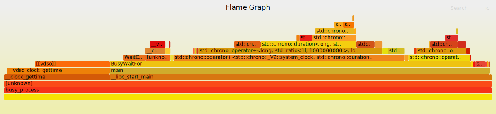

# Perf

Linux performance analysis tool

## Resources 

http://www.brendangregg.com/perf.html

## Simple Example

1. Build and execute binary with debug data `bazel run //perf/busy_process:busy_process -c dbg`
2. Get process id `ps aux | grep busy_process`
3. Record perf_events into perf.data file `perf record -F 99 -p 13694 -g -- sleep 10`
4. Show perf report `perf report`
```
Samples: 971  of event 'cycles:uppp', Event count (approx.): 32223903647
  Children      Self  Command        Shared Object        Symbol
+   78,90%     0,00%  busy_process  [unknown]            [k] 0x1f06258d4c544155
+   78,90%     0,00%  busy_process  libc-2.27.so         [.] __libc_start_main
+   78,90%     0,00%  busy_process  busy_process        [.] main
+   75,17%     2,66%  busy_process  busy_process        [.] BusyWaitFor
+   50,80%     4,23%  busy_process  busy_process        [.] std::chrono::operator+<std::chrono::_V2::system_clock, std::chrono::duration<long, st
+   41,88%     7,60%  busy_process  busy_process        [.] std::chrono::operator+<long, std::ratio<1l, 1000000000l>, long, std::ratio<1l, 1l> >
+   24,92%     1,67%  busy_process  libc-2.27.so         [.] __clock_gettime
+   24,24%     9,54%  busy_process  [vdso]               [.] __vdso_clock_gettime
+   24,14%     0,00%  busy_process  [unknown]            [.] 0x00007ffccfbcaf58
+   18,79%     7,37%  busy_process  busy_process        [.] std::chrono::duration<long, std::ratio<1l, 1000000000l> >::duration<long, std::ratio<
+   12,01%     1,38%  busy_process  busy_process        [.] std::chrono::operator><std::chrono::_V2::system_clock, std::chrono::duration<long, st
+   11,97%    11,97%  busy_process  busy_process        [.] std::chrono::duration<long, std::ratio<1l, 1000000000l> >::count
+   11,84%    11,84%  busy_process  [vdso]               [.] 0x0000000000000977
+   10,14%     3,27%  busy_process  busy_process        [.] std::chrono::operator< <std::chrono::_V2::system_clock, std::chrono::duration<long, s
+    9,83%     2,14%  busy_process  busy_process        [.] std::chrono::duration_cast<std::chrono::duration<long, std::ratio<1l, 1000000000l> >,
+    9,53%     9,53%  busy_process  busy_process        [.] std::chrono::duration<long, std::ratio<1l, 1000000000l> >::duration<long, void>
Press '?' for help on key bindings
```
5. Get tool to visualize data as FlameGraph: `git clone https://github.com/brendangregg/FlameGraph`
6. Generate FlameGraph:
```
perf script | ./FlameGraph/stackcollapse-perf.pl > out.perf-folded
cat out.perf-folded | ./FlameGraph/flamegraph.pl > perf-kernel.svg
```
