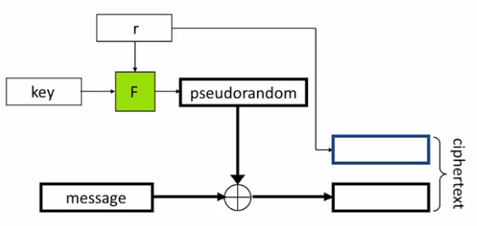

#Cryptography

" the art of writing or solving codes"

Goals of modern cryptography:

* Data integrity, authentication, protocols, ...
* The public-key setting
* Foundations e. g. number theory to systems e. g. distributed e-cash

Examples for usages:

* password (hashing)
* secure credit-card transations
* ecripted WiFi
* digitally signed software updates
* Bitcoins

Book recommendation: Introduction to Modern Cryptography (ISBN-13: 978-1466570269)

## Content:

1. Introduction and Classical Cryptography
1. Computational Secrecy and Principles of Modern Cryptography
1. Private-Key Encryption
1. Message Authentication Codes
1. Number Theory
1. Key Exchange and Public-Key Encryption
1. Digital Signatures

## Introduction and Classical Cryptography

Historically focused on secure communication.
Based on exchangeing a secret key in advance 
--> Private-key cryptography (also secret-key, shared-key, symmetric-key) 

Two users share secret key in advance. 
Senser encryptes message using the key before sending. 
Receiver can decode the message with the key.

Goal: Nobaody shall be able to see content, without the key.

Also applicable for encrypthing hard drive and so on.

Method needs three fundamental algorithms:

1. Generate key (Gen k)
1. Encrypte c <-- Enc<sub>k</sub>(m)
1. Decrypte m := Dec<sub>k</sub>(c)

<-- Output may be influenced by random values
:=  Deterministic output

For every encryptions Dec<sub>k</sub>(Enc<sub>k</sub>(m)) = m needs to be true

25 = 35 mod 10;
25 mod 10 = 5 = 35 mod 10

    25 ≠ [35 mod 10];
5 = [35 mod 10]

    ## #Formal definition of simple code

        Shift each letter in the alphabet by
        k(wrap around at the end)
            .-- > Enc<sub> 1 < / sub >
    (abc)-- > bcd

                      *Gen
    : choose uniform k ∈ {0, ..., 25} *
      Enc<sub> k</ sub>(m<sub> 1 < / sub > ... m<sub> t</ sub>)
    : output c<sub> 1 <
    / sub > ... c<sub> t</ sub>,
    where c<sub> i</ sub>
    : = [m<sub> i</ sub> + k mod 26] * Dec<sub> k</ sub>(c<sub> 1 < / sub >
                                                         ... c<sub> t</ sub>)
    : output m<sub> 1 <
        / sub > ... m<sub> t</ sub>
    : = [c<sub> i</ sub> - k mod 26]

      Is this secure
      ? There are 26 possibilities-- > easily possible to try all and choose the one, which results in proper text
If the attacker knows the encryption method. This should be always assumed.
--> The only secret is the key --> the key must be chosen random, to keep the secret **(Kerckoff's principle)**

Lession learned:
Key space must be large enough to prevent brute force attacks

We increase the key space by using an string as an key:
```
s =   "seeyouatnoon"
key = "spyspyspyspyspy"
res = ""

for i,e in enumerate(s):
    small_letters_ascii_offset = 97
    number_in_alphabet = ord(e) - small_letters_ascii_offset
    k_number_in_alphabet = ord(key[i]) - small_letters_ascii_offset
    v = (number_in_alphabet + k_number_in_alphabet) % 26
    print("v: {}, k: {} = {}".format(number_in_alphabet, k_number_in_alphabet, v))
    encoded_ascii = v + small_letters_ascii_offset
    res += str(chr(encoded_ascii))

print(res)
```
Now we have a very large key space e. g. with 14 character key 26<sup>14</sup> about 2<sup>66</sup>
But if we look at every 14th character and combine this with the plaintext letter frequencies, we can find the key. For example the most common character in the encrypted text most likely corresponds with the most frequently occouring carracter in the encrypted text. 

Lession learned:
Key space is not enough to withstand clever attacks
--> It would be nice to prove, that a code is secure

## Core Principles of modern crypto

* Definitions (formal)
  Precise, mathematical model and defintion of what security means
* Assumptions
  Clearly stated and unambigous
* Proof of security
  Move away form design-break-patch
 --> Proof is always relative to definition and assumtions

## Perfect Secrecy

Definitions have two parts:
1. Thread model
2. Security guarantee/goal

#### Probability review

Random variable: Variable that takes on (discrete) values with certain probabilities

Probability distribution must be between 0 and 1. All values sum to 1.

Event: A particular occurrence in some experiemnt; Pr[E] = probability of event E

Conditional probability: Probability that one event occurs assuming some other event occurred; Pr[A | B] = Pr[A and B]/Pr[B]

Two random variables are independent if for all x, y: Pr[X=x | Y=y] = Pr[X=x]; The value of y does not influence the x.

Law of total probability: say E<sub>1</sub>, ..., E<sub>n</sub> are a partition of all possibilities (one and only one of them has to occur). Then for any A: Pr[A] = Σ<sub>i</sub>Pr[A and E<sub>1</sub>] = Σ<sub>i</sub>Pr[A | E<sub>i</sub>] * Pr[E<sub>i</sub>] 


### Private-key encryption

Share key between users. Use key for encryption and decryptions.

Example for thread models:

* Ciphertext-only attack: One ciphertext or many known to the attacker?
* Known-plaintext attack: Attacker knows plaintext and encrypted version e. g. attacker knows that the first exchanged message is "Hello"
* Choosen-plaintext attack: Attacker can obtain encryted version for any string
* Choosen-ciphertext attack: Aditionally to chosen-plaintext attack the attacker can decrypt certain things

Security goal for thread model Ciphertext-only attack with one ciphertext:
Regardless of any prior information the attacker has about the plaintext, the ciphertext should leak no additional information about the plaintext.

**M**: Message space
**K**: key space
**C**: ciphertext space

M: a random variable denoting the value of the message
K: random variable denoting the key; Key generation (Gen) algorithm determines K --> Gen defines the probability distribution for K

Assumption:
Random variables M and K are independet

Encrypting a message defines a distribution on the ciphertext.
C: random value denoting the value for the ciphertext

Expample for shift cipher:
k element of {0, ... 25}, Pr[K=k] = 1/26
Assume: Pr[M = 'a'] = 0.27, Pr[M = 'z'] = 0.3
--> Pr[C = 'b'] = Pr[M = 'a'] * Pr[K = 1] + Pr[M = 'z'] * Pr[K=2] = 0.7 * (1/26) + 0.3 * (1/26) = 1/26

**Definition for perfect secrecy**:
For Pr[C = c] > 0
Pr[M = m | C = c] = Pr[M = m]  --> Seeing a encrypted message c, does not change the knowledge of the attacker about m

Expample with shift cipher and distribution:
Pr[M = 'one'] = 0.5, Pr[M = 'ten'] = 0.5
take m = 'ten' and c = 'rqh' 
Pr[M = 'ten' | C = 'rqh'] = 0 ≠ Pr[M = 'ten] 
Because there is no possible shift from 'ten' to 'rqh'
--> Shift cipher does not meet perfect secrecy

Review of bayes's theorem:
Pr[A | B] = Pr[B | A] * Pr[A]/Pr[B]

--> How can we construct a perfectly secret scheme?

#### The One-Time Pad

**M**={0,1}<sup>n</sup> --> The notation 0,1 to the n means that the set of all strings,
of all binary strings, of length exactly n, so the set of all n bit strings. 
Gen: choose a uniform key k ∈ {0,1}<sup>n</sup> 
Enc<sub>k</sub>(m) = k ⨁  m (bit-wise XOR)
Dec<sub>k</sub>(c) = k ⨁  m

Prove that one-time pad is perfectly secret:
Fix arbitrary distribution over **M**={0,1}<sup>n</sup>, and arbitrary m,c ∈ {0,1}<sup>n</sup>
So we can prove that 
Pr[M=m | C=c] = Pr[M=m]. 
Proof can be found online.
--> One time pad meets perfect secrecy criteria.

Implementing the one time pad:

Why?
Better understanding
Gives us the oportunity to look at some implementation level details

We need **random-number generation** e. g. for obtaining the key.
This is a two step process:
1. Continually collect a "pool" of high-entropy (i. e. "unpredictable") data
   This data comes typically from external sources e. g. delays between network events, hard-disk access times, keystroke/mouse movements, ... or hardware random-number generation e. g. Intel
2. When random bits needed, process this data to generate independent, uniform sequence bits
   May "block" if insufficient entropy available
   Process bits from the pool to provide a uniform distribution.
   Unix: Read form file /dev/random
   Often crypto libriaries provide methods to access random numbers

###### Limitations of One-time pad

* The key is as long as the message
* Only secure if each key is used to encrypt a single message
--> Parties must share keys of (total) length equal to the (total) length of all the messages they might ever send.

If a key is used twice:
c1 = k ⨁  m1
c2 = k ⨁  m2
Attacker can compute: c1 ⨁ c2 = (k ⨁ m1) ⨁ (k ⨁ m2) = m1 ⨁ m2 
--> Information is leaked about m1 and m2.

**These limitations are inherent for schemes achieving perfect secrecy**

## Computational Secrecy

Idea: Releax the security implications (from perfect secrecy) to enalbe more practically useful algorithms e. g. allow leak of some informations if the attacker has unlimited resources.

Allow tiny probability of failure:
Should we be concered with a failure probability of 2<sup>-60</sup>? With the same probability the sender and the receiver will be both struck by lightning in the next year. If an event occures with 2<sup>-60</sup>/s, then it expected that the event occures once per 100 billion years.

Resources of an attacker:
Assume a computer can test one key per clock cycle. Then an attacker is able to test

- about 2<sup>57</sup> keys/year with a desktop computer
- about 2<sup>80</sup> keys/year with a supercomputer
- about 2<sup>112</sup> keys with a supercomputer working since the big bang
--> It is reasonable that a attacker can't probe more than 2<sup>112</sup> keys. Modern algorithms have a key space of 2<sup>118</sup> or more.

### Perfect indistinguishability

Informally:
Assumption: There are two messages m0 and m1
--> The attacker observes the encrypted version and is not able to determine the original message with a propability better than 0.5
Pr[PrivK<sub>A,pi</sub>=1] <= 0.5

Claim: Perfect indistinguishablility and perfect secrecy are the same. (Prove possible, but not given)

### Releax the defintion

* Allow security to fail with a small probability
* Consider only efficient attackers

#### Concrete security

Algorithm pi is (t, epsilon)-indistinguishalbe if for an attacker running in at most time t, it holds: Pr[PrivK<sub>A,pi</sub>=1] <= 0.5 + epsilon

Advantages:
t and epsilon suite real world requirements

Disadvanteges:
Sensitive to exact computational model --> no clear theory
Would like to have schemes, were the user can adjust the level of security; possible with asymptotic security

#### Asymptotic security

* Introduce a security parameter n element **Z<sup>+</sup>**
  * Fixed by honest parties at initialization
  * Allows users to choose security level (key lenght)
  * known to the adversary
* View running time of all parties success probability of adversary as a function of n

-->
Computational indistinguishablility:
* Security may fail with probability negligible in n; A function is negligible if for every polynomial p there is an N such that f(n) < 1/p(n) for n > N; typical example: f(n) = ply(n) * 2<sup>-cn</sup>
* Restrict attention to attackers running in time polynomial in n (There is a function, which is the upper bound of the attack runtime f(n)=Sum<sub>i</sub>(c<sub>i</sub> * n<sup>i</sup>) for all n; c is a constant

Pr[PrivK<sub>A,pi</sub>(n)=1] <= 0.5 + epsilon(n)

Simple example:
Scheme, where the best attack is a brute forece search over the key space and Gen(1<sup>n</sup>) takes a uniform n-bit key
So if attacker A runs in time t(n), then
Pr[PrivK<sub>A,pi</sub>(n)=1] < 0.5 + t(n)/2<sup>n</sup>
The sheme is indistinguishable for any polynomial t for which the function t(n)/2<sup>n</sup> is negligible

---
**Pseudorandomness**

Informal: Distribution can't be distinguished form a uniform distribution.
Sample x according to distribution (D x <-- D)
Historically D was considered peudorandom, if it passed a bunch of statistical tests. --> This does not hold for an adversary situation
Modern definition: D is pseudorandom, if it passes **every efficient** statistical test or the difference is negligible (< epsilion(n))

Pesudoranmdom (number) generators (PRG)

Efficient deterministic algorithm, which expands a short input (seed) into a longer, pseudorandom output.
If you input true random inputs, the output will be a lot of random looking bits.
PRG's are deterministic.

**We do not know, if pseudorandom generators exist.**
There are practically proved functions.

---

#### The pseudo on-time pad

Key is expanded with a pseudorandom generator and that output is used to encryped (xor) the message.
--> Much smaller key, than message to encrypt.
It is secure with respect to asymptotic security and that a pseudorandom generator is used.
--> It can be broken by finden a weakness in the PRG or asumptotic security is not strong enough for the problem (computational security)

**We can't use the same key more than once**

#### CPA-Secure Encryption from PRFs/Block Ciphers
Strenghten thread model form single message secrecy to multiple message secrecy.
We will jump directly to choosen plaintext attacks (nowadays this is minimal necessary).
--> To protect against this, the encryption must be randomized. So that the attacker can't compare encrypted messages to gain informations. If the encryption would be deterministic, the encrypted version of a message would be always the same and the attacker could guess the message by encrypting messages in the same way. 
This also hides, if the same message is sent more than once.
To reach this you need [Pseudo-random permutations](https://en.wikipedia.org/wiki/Pseudorandom_permutation). They are mapping an input of lenght n to an output of lenght n using an key of lenght n and back.


The key k and a uniformly choosen value r can be used as inputs to a pseudo-random function. The output is used to encryped the message. The value r and the encrypted message are sent to the receiver, who uses the known key and the sent value r for decryption. Because r is choosen uniformly, the encrypted version of the same message differes each time. 

Here the key is as long as the message, but the same key can be used for more than one message. r is also as long as the message --> data send to the receiver is twice as long as the message.
This can be improved by splitting the message into shorter chunks and using something like the [Counter Mode for Block Ciphers](https://de.wikipedia.org/wiki/Counter_Mode) or [cipher block chaining mode](https://de.wikipedia.org/wiki/Cipher_Block_Chaining_Mode).

**Be careful**: electronic code book mode is not secure. Especially because duplicated messages/message parts are encrypted to the some cipher text --> information is leaked.

### Defend against Chosen-Ciphertext Attacks

Active attacker, who interferes the communication, changes the message and transfers it to the receiver.
--> Danger: The scheme could be malleable if it is possible to modify a ciphertext and thereby cause a predictable change to the plaintext (informal definition) e. g. encrypted email, encrypted transaction

**All the schemes we have seen so far are malleable.**

Additionally the attacker can send fake data to the receiver.

Model: Allow attacker to submit ciphertexts of its choice* to the receiver and learn the corrensponding plaintext. Additionally the attacker is able to execute a chosen-plaintext attack.
* With the restriction: The attacker can't ask for decryption of the challenge ciphertext from the decryption oracle (receiver).
This model captures every real world scenario.

#### Padding-Oracle Attacks

Real world example, how one leaked bit can lead to a leaking the entire plaintext.

CBC mode of encryption.
PKCS #5 encoding: Add padding to get a message of a length, which is a multiple to the blocklength (b > 0 number of bytes appended to the plaintext, 1<=b<=L); Padding consists of value b repeated b times.
PKCS #5 example: 
AB 01 4F 21 00 7C *02* *02*
AB 01 4F 21 00 7C <-------> Stripped of by receiver
Possible attack: 
Attacker can probe if the receiver, if the message is correct encoded (Receiver would return an error, if padding would be incorrect)
[Padding Oracle Attack](https://en.wikipedia.org/wiki/Padding_oracle_attack)

Solution: Make sure the message integrity is not violated

## Message Integrity

Goal:

* Ensure that received message originated from the intendet party 
* and was not modified 
* even if the attacker controls the channel

### Message authentication code

Idea: 
Sender uses the key and the message to generate an message authentication code. The code and the message are sent to the receiver.
Receiver uses the shared key, the received message and the received authentication code to verify if the data has the correct origin and was not altered.

Use cases:
* Sender and receiver seperated in space e. g. user communicates with bank.
* Sender and receiver are the same, but to different points in time e. g. server provides coodie to user and receives durring a later session. So the server needs to verify if the cookie is unaltered and from an valid origin.

You can have secrecy and integrity together or seperated. Encryption does not provide any sort of integrity (every change to the encrypted version, is propagated to the unencypted version even if the result is probably not predictable to the attacker).

Defined by three algorithms:
* key generation k = Gen()
* code generation t = Mac<sub>k</sub>(m)
* verification Vrfy<sub>k</sub>(t', m')

Thread Model:
Adaptive chosen-message attack: Assume the attacker can induce the sender to authenticate messages of the attackers choice.

Security goal:
Existential unforgeability: Attacker should be unable to forge a valid tag on any message not authenticated by the sender. 
So the attacker can use the sender to authenticate messages, observe messece code pairs, but with all that information he shall not be able to authenticate not previosly observed messages.

Why is the security goal so strong?
We don't want to make any assumtion about what the sender authenticates and what kind of forgaries are possible. 
--> The solution can be applied anywhere where integrity is needed.

**Replay attacks are not prevented** --> Different protection needed.

Simple MAC for short fixed length messages
Use a length-preserving pseudorandom function with uniformly chosen key k
Disadvantages: Limited to fixed length messages and short messages
--> 
[CBC-MAC](https://en.wikipedia.org/wiki/CBC-MAC)

Differences to CBC-mode:

* Deterministic (no initialization vector)
* in CBC-MAC, only the final value is output and verification is done by re-computing the result

Both differences are essential for security.
This method is restriced to messages witch are exactly l blocks of length n long.
--> Usefull for arbitrary, but fixed length
This can be inproved. 
e. g. include the message length (number of blocks l) as content of the first block of the message.
There are also ways to remove the n * l length restriction.

### Hash functions

Maps arbitrary length inputs to a short fixed-length output (digest).

MAC can be used to safely transmit the digest or the encoded verion (t). Rest of the message is transimitted with an unsafe channel. --> Receiver is able to detect any change in the payload and therefore detect attacks.

HMAC: Can be viewed following the above apporach and exploiting certain probabilities of MD5 (do not use anymore), SHA1 and SHA2 to efficiently compute the combination of MAC and digest.

## Secrecy + Integrity

--> Encrypt and authenticate 
Sender and receiver share to keys. First is used for encryption and add a authentication code. 
But the tag t can leak information. E. g. if the MAC is determinisitc (which it is often) the attacker can determine if the message was send multiple times.
--> Encrypt then authenticate --> if encryption is CPA secure and MAC is secure --> combination is secure
Additionally it is not feasable for an attacker to generate any new valid ciphertext, even if he observed ciphertexts before (or even with chosen plaintext attacks). This is called **authenticated encryption scheme**. Authenticated encryption schemes with CPA secure encruption is also chosen ciphertext secure.

Other ways of achieving security and integrity are possible. 

## Secure sessions

Session: Period of time over which the two parties are willing to maintain state.
Even with a security and integrity as discribed above (authenticated encryption) a number of attacks are possible:

* Replay attack
* Re-order attack (deliver messages in different orders)
* Reflection attack (play message back to sender)

These and other can be prevented easily using counters and identity, before the encryption. --> Secure session
